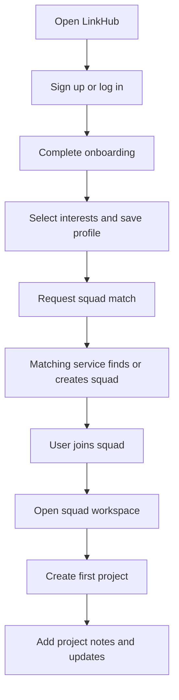

## 1. Product Overview
LinkHub is a student collaboration platform focused on one job: help students find a squad and start a project together.
- It solves the early-stage problem of students not knowing who to build with, how to match around shared interests, and how to begin collaboration quickly.
- Its value is a focused MVP that converts signup into squad formation and project creation without distracting social features.

## 2. Core Features

### 2.1 User Roles
| Role | Registration Method | Core Permissions |
|------|---------------------|------------------|
| Student User | Email registration | Create account, manage profile, get matched into squads, create/view squad projects, add project notes |

### 2.2 Feature Module
1. **Authentication**: signup, login, JWT session handling, protected routes
2. **Onboarding**: interest selection, profile setup, save interests to database
3. **Squad Matching**: match student into a squad of 3-5 members using overlapping interests
4. **Squad Workspace**: squad details, members, rematch request limit, optional leave squad
5. **Projects**: create project inside squad, view projects, optional status
6. **Project Notes**: lightweight collaboration updates attached to a squad project
7. **Profile**: private self-view showing profile, interests, squad, and projects

### 2.3 Page Details
| Page Name | Module Name | Feature description |
|-----------|-------------|---------------------|
| Auth Page | Signup form | Create account with name, email, password, validation, duplicate email protection |
| Auth Page | Login form | Authenticate with email and password, receive JWT, handle invalid credentials |
| Onboarding Page | Interest selector | Multi-select interests, require minimum selection, persist to backend |
| Onboarding Page | Profile form | Save editable name and optional bio before matching |
| Match Page | Match CTA | Trigger squad matching based on shared interests and rematch limits |
| Match Page | Match result | Show assigned squad, members, and next action to open workspace |
| Squad Page | Squad overview | Show squad name, member list, created date, and membership status |
| Squad Page | Squad controls | Allow limited "find new squad" action and optional leave squad action |
| Squad Page | Project list | Fetch projects linked to active squad |
| Project Page | Create project form | Create project with title, description, and optional status |
| Project Page | Project details | Show project summary and note history |
| Project Page | Notes panel | Add lightweight updates or collaboration notes to a project |
| Profile Page | Private profile | Show own name, bio, interests, squad membership, and owned squad projects |

## 3. Core Process
Primary user journey:
- A student signs up and logs in.
- The student completes onboarding by selecting interests and saving a basic profile.
- The student triggers squad matching and is placed into a 3-5 member squad with overlapping interests.
- The student opens the squad workspace, sees members, and starts a project.
- The squad uses lightweight project notes to coordinate initial collaboration.

## 4. User Interface Design
### 4.1 Design Style
- Primary colors: warm ivory background, deep ink text, electric violet as brand accent, success green for squad/project actions
- Secondary colors: sky blue for utility actions, soft rose for empty or soft states, muted earth tones for surfaces
- Button style: rounded controls, strong filled primary actions, subtle outlined secondary actions
- Font and sizes: distinctive display font for headings, clean readable sans-serif for product text, strong visual hierarchy
- Layout style: desktop-first app shell with sidebar + content workspace, card-based content clusters, responsive stacking on smaller screens
- Icon style suggestions: simple symbolic icons, subtle emoji support for warmth, clean accent shapes for onboarding and squad states

### 4.2 Page Design Overview
| Page Name | Module Name | UI Elements |
|-----------|-------------|-------------|
| Auth Page | Split auth shell | Branded left panel, concise value messaging, stacked forms, validation states |
| Onboarding Page | Interest selection | Selectable chips, progress indicator, clear CTA, friendly setup tone |
| Match Page | Matching panel | Summary cards, squad reveal state, interest overlap cues, empty/loading states |
| Squad Page | Squad workspace | Member cards, squad metadata, project rail, action bar for rematch/leave |
| Project Page | Project editor | Structured create form, project cards, note timeline, compact update composer |
| Profile Page | Profile summary | Personal stats, interest chips, squad card, project list, lightweight editable section |

### 4.3 Responsiveness
- Desktop-first layout with optimized workspace views for laptop screens
- Tablet adaptation collapses sidebar and simplifies workspace density
- Mobile adaptation stacks sections vertically, keeps auth and onboarding tap-friendly, and preserves only core MVP flows

