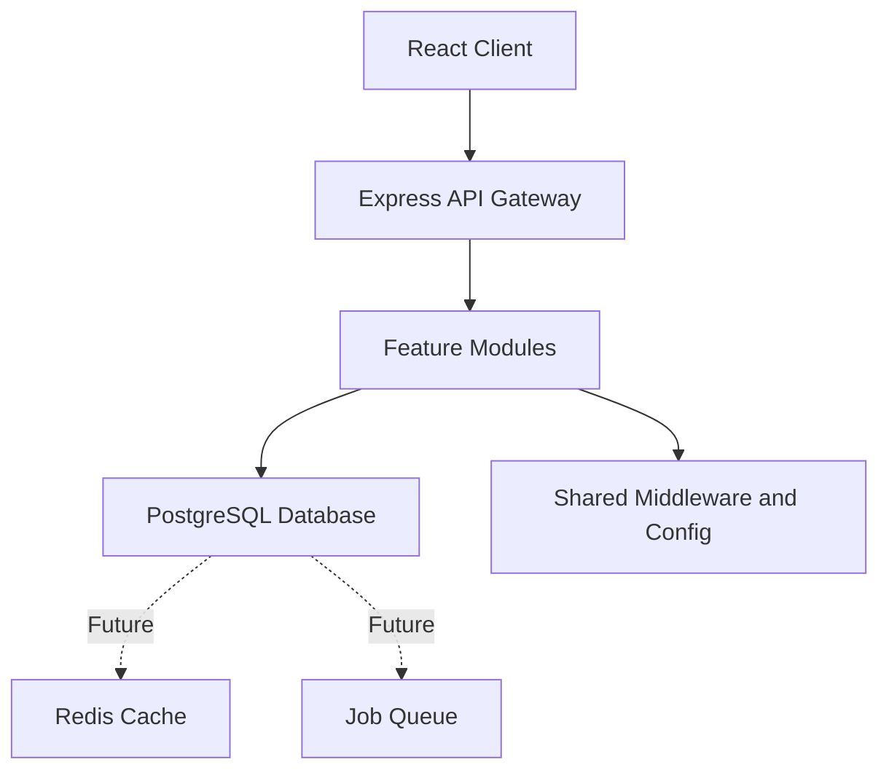
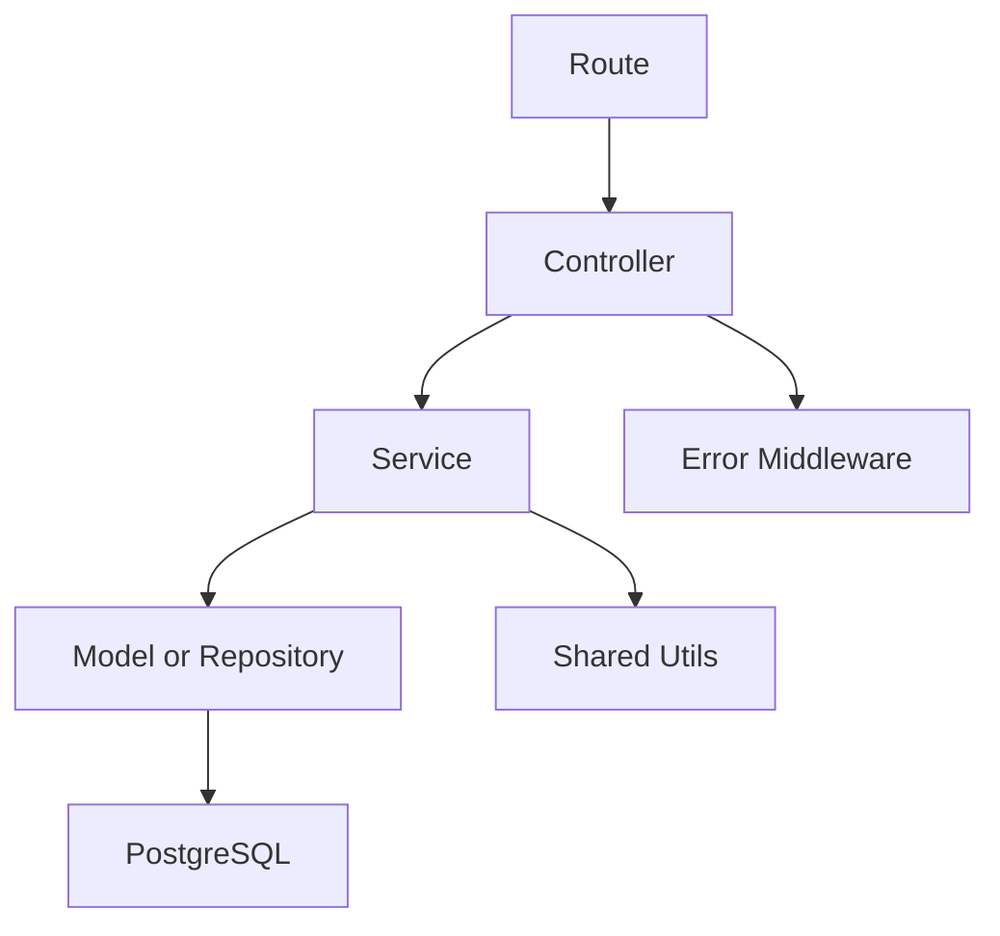
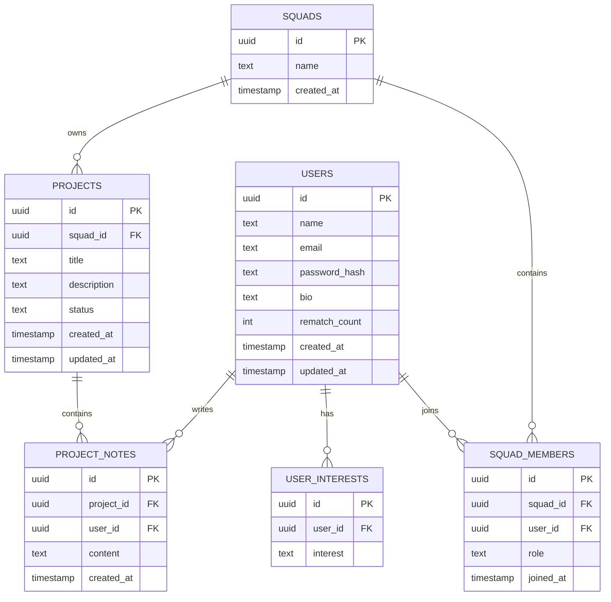

## 1. Architecture Design


## 2. Technology Description
- Frontend: React@18 + Vite + React Router + CSS Modules or scoped feature styles
- Initialization Tool: Vite
- Backend: Express@4 modular monolith
- Database: PostgreSQL
- Validation: Zod
- Authentication: JWT + bcrypt
- Security: Helmet + express-rate-limit + CORS
- Logging: Winston
- Environment: dotenv

## 3. Route Definitions
| Route | Purpose |
|-------|---------|
| /login | Student login page |
| /signup | Student registration page |
| /onboarding | Interest and profile setup page |
| /match | Squad matching page |
| /squad | Active squad workspace |
| /projects | Squad project view and creation page |
| /profile | Private profile page |

## 4. API Definitions

```ts
type AuthUser = {
  id: string;
  name: string;
  email: string;
};

type AuthResponse = {
  token: string;
  user: AuthUser;
};

type SignupRequest = {
  name: string;
  email: string;
  password: string;
};

type LoginRequest = {
  email: string;
  password: string;
};

type UpdateProfileRequest = {
  name: string;
  bio?: string;
  interests: string[];
};

type SquadMember = {
  id: string;
  userId: string;
  name: string;
  bio?: string;
  interests: string[];
  role: "member" | "owner";
};

type SquadResponse = {
  id: string;
  name: string;
  createdAt: string;
  members: SquadMember[];
};

type ProjectRequest = {
  title: string;
  description: string;
  status?: "idea" | "building" | "done";
};

type ProjectResponse = {
  id: string;
  squadId: string;
  title: string;
  description: string;
  status: "idea" | "building" | "done";
  createdAt: string;
};

type ProjectNoteRequest = {
  content: string;
};
```

Key endpoints:
- `POST /api/auth/signup`
- `POST /api/auth/login`
- `GET /api/auth/me`
- `GET /api/users/me`
- `PATCH /api/users/me`
- `POST /api/squads/match`
- `GET /api/squads/me`
- `POST /api/squads/rematch`
- `POST /api/squads/leave`
- `GET /api/projects`
- `POST /api/projects`
- `GET /api/projects/:projectId`
- `POST /api/projects/:projectId/notes`

## 5. Server Architecture Diagram


Backend folder contract:
- `/src/modules/auth`
- `/src/modules/users`
- `/src/modules/squads`
- `/src/modules/projects`
- `/src/shared/middlewares`
- `/src/shared/utils`
- `/src/shared/config`
- `/src/app.js`
- `/src/server.js`

Each module contains:
- `*.routes.js`
- `*.controller.js`
- `*.service.js`
- `*.model.js`

## 6. Data Model
### 6.1 Data Model Definition


### 6.2 Data Definition Language
```sql
CREATE EXTENSION IF NOT EXISTS "pgcrypto";

CREATE TABLE users (
  id UUID PRIMARY KEY DEFAULT gen_random_uuid(),
  name TEXT NOT NULL,
  email TEXT NOT NULL UNIQUE,
  password_hash TEXT NOT NULL,
  bio TEXT,
  rematch_count INT NOT NULL DEFAULT 0,
  created_at TIMESTAMP NOT NULL DEFAULT NOW(),
  updated_at TIMESTAMP NOT NULL DEFAULT NOW()
);

CREATE TABLE user_interests (
  id UUID PRIMARY KEY DEFAULT gen_random_uuid(),
  user_id UUID NOT NULL REFERENCES users(id) ON DELETE CASCADE,
  interest TEXT NOT NULL
);

CREATE INDEX idx_user_interests_user_id ON user_interests(user_id);
CREATE INDEX idx_user_interests_interest ON user_interests(interest);

CREATE TABLE squads (
  id UUID PRIMARY KEY DEFAULT gen_random_uuid(),
  name TEXT NOT NULL,
  created_at TIMESTAMP NOT NULL DEFAULT NOW()
);

CREATE TABLE squad_members (
  id UUID PRIMARY KEY DEFAULT gen_random_uuid(),
  squad_id UUID NOT NULL REFERENCES squads(id) ON DELETE CASCADE,
  user_id UUID NOT NULL REFERENCES users(id) ON DELETE CASCADE,
  role TEXT NOT NULL DEFAULT 'member',
  joined_at TIMESTAMP NOT NULL DEFAULT NOW(),
  CONSTRAINT unique_user_per_squad UNIQUE (user_id)
);

CREATE INDEX idx_squad_members_squad_id ON squad_members(squad_id);

CREATE TABLE projects (
  id UUID PRIMARY KEY DEFAULT gen_random_uuid(),
  squad_id UUID NOT NULL REFERENCES squads(id) ON DELETE CASCADE,
  title TEXT NOT NULL,
  description TEXT NOT NULL,
  status TEXT NOT NULL DEFAULT 'idea',
  created_at TIMESTAMP NOT NULL DEFAULT NOW(),
  updated_at TIMESTAMP NOT NULL DEFAULT NOW()
);

CREATE INDEX idx_projects_squad_id ON projects(squad_id);

CREATE TABLE project_notes (
  id UUID PRIMARY KEY DEFAULT gen_random_uuid(),
  project_id UUID NOT NULL REFERENCES projects(id) ON DELETE CASCADE,
  user_id UUID NOT NULL REFERENCES users(id) ON DELETE CASCADE,
  content TEXT NOT NULL,
  created_at TIMESTAMP NOT NULL DEFAULT NOW()
);

CREATE INDEX idx_project_notes_project_id ON project_notes(project_id);
```

